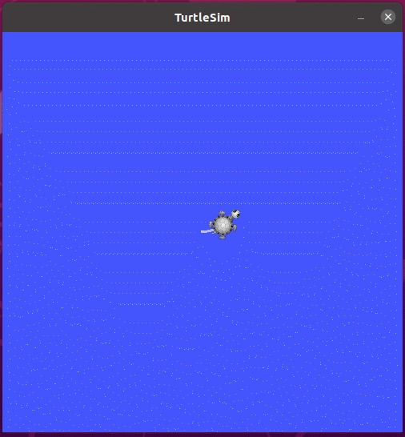

# 第 2 章 ROS通信机制

机器人是一种高度复杂的系统性实现，在机器人上可能集成各种传感器(雷达、摄像头、GPS...)以及运动控制实现，为了解耦合，在ROS中每一个功能点都是一个单独的进程，每一个进程都是独立运行的。更确切的讲，**ROS是进程（也称为*****Nodes*****）的分布式框架。** 因为这些进程甚至还可分布于不同主机，不同主机协同工作，从而分散计算压力。不过随之也有一个问题: 不同的进程是如何通信的？也即不同进程间如何实现数据交换的？在此我们就需要介绍一下ROS中的通信机制了。

ROS 中的基本通信机制主要有如下三种实现策略:

- 话题通信(发布订阅模式)
- 服务通信(请求响应模式)
- 参数服务器(参数共享模式)

本章的主要内容就是是介绍各个通信机制的应用场景、理论模型、代码实现以及相关操作命令。本章预期达成学习目标如下:

- 能够熟练介绍ROS中常用的通信机制
- 能够理解ROS中每种通信机制的理论模型
- 能够以代码的方式实现各种通信机制对应的案例
- 能够熟练使用ROS中的一些操作命令
- 能够独立完成相关实操案例

案例演示:

1.话题演示案例:

控制小乌龟做圆周运动

获取乌龟位姿

2.服务演示案例:在指定位置生成乌龟

3.参数演示案例:改变乌龟窗口的背景颜色

